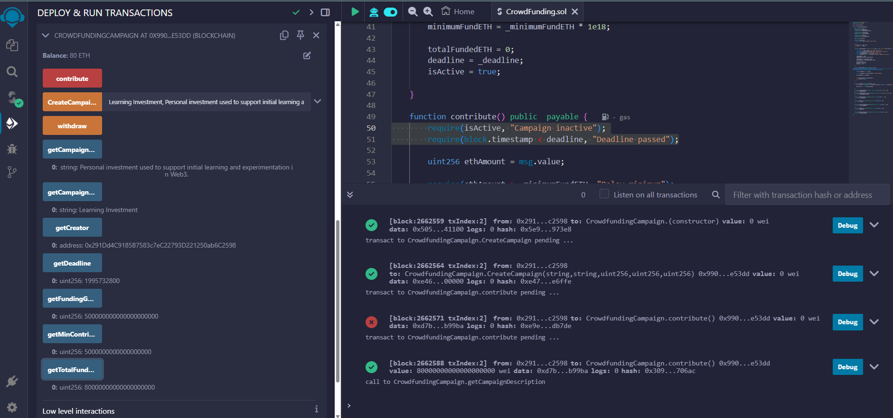
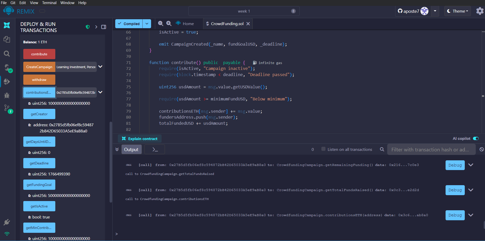

# Polkadot Bootcamp Week 1: Solidity Lab & Homework

This repository contains the smart contracts developed for the Week 1 Lab Exercise and Homework of the Polkadot Bootcamp. The project focuses on basic Solidity concepts, including state variables, functions, data types, and contract interactions.

## Project Structure

-   `CrowdFunding.sol`: A comprehensive crowdfunding campaign contract.
-   `DataTypes.sol`: A contract demonstrating various Solidity data types and variable scopes.
-   `PriceFeedLibrary.sol`: A library used by the Crowdfunding contract to handle USD price conversions (via Chainlink or similar logic).
-   `screenshots/`: Contains evidence of successful deployment and testing on Remix.

---

## 1. Crowdfunding Campaign Contract (`CrowdFunding.sol`)

The main objective was to create a contract that manages a crowdfunding campaign with specific requirements and enhancements.

### Features

-   **Campaign Details**: Stores name, description, funding goal (in USD), and the creator's address.
-   **Funding Tracking**: Tracks total funds raised in USD and individual contributions in ETH.
-   **Time Management**: Includes a campaign deadline and calculates remaining days.
-   **Safety Checks**: Implements a minimum contribution amount and an active status flag.
-   **Price Conversion**: Uses `PriceFeedLibrary` to convert ETH contributions into USD values for goal tracking.

### Key Functions

-   `CreateCampaign`: Allows the owner to initialize campaign details.
-   `contribute`: Enables users to send ETH to the campaign (converts to USD value).
-   `withdraw`: Allows the owner to withdraw funds once the campaign is complete.
-   **Getters**:
    -   `getCampaignName()`, `getCampaignDescription()`
    -   `getFundingGoal()`, `getTotalFundsRaised()`
    -   `getDeadline()`, `getMinContribution()`, `getIsActive()`
-   **Helper Functions**:
    -   `getRemainingFunding()`: Calculates how much more USD is needed.
    -   `getDaysUntilDeadline()`: Returns the number of days left.

---

## 2. Data Type Experiment (`DataTypes.sol`)

This contract serves as an educational tool to demonstrate Solidity's data types and the difference between state and local variables.

### Demonstrated Data Types

1. `uint256`: Unsigned integers for numerical operations.
2. `string`: For text data.
3. `bool`: For logical true/false states.
4. `address`: For storing Ethereum/EVM addresses.
5. `bytes32`: For fixed-size byte arrays (often used for hashes).

### Key Concepts

-   **State Variables**: Stored on the blockchain (e.g., `stateUint`, `stateString`).
-   **Local Variables**: Exist only during function execution (e.g., `localUint`, `localDemo`).
-   **Operations**: Functions like `operateUint`, `operateString`, and `operateBytes` show how to manipulate these types.

---

## 3. Remix Practice & Deployment

The contracts were tested and deployed using the Remix IDE.

**Deployed Contract Address (Paseo Asset Hub):**

-   `CrowdfundingCampaign`: `0x9906C227Cd9164EF479869151D3c52ef6d9e53dd`
-   `DataTypeExperiment`: `0xC5E43FC08d9AFD2134e510cb769a41b2DDBD9634`

### Submission Checklist

-   [x] Contract compiles without errors.
-   [x] All required functions implemented.
-   [x] Contract deployed successfully on Remix (JavaScript VM / Paseo Asset Hub).
-   [x] Screenshots of deployment and function calls saved in `screenshots/`.
-   [x] MetaMask connected to Paseo Asset Hub (for testnet deployment).
-   [x] Contract address included.

### Screenshots

#### Paseo Asset Hub Deployment

#### Sepolia Testnet Deployment

## How to Use

1. Open [Remix IDE](https://remix.ethereum.org/).
2. Upload `CrowdFunding.sol`, `DataTypes.sol`, and `PriceFeedLibrary.sol`.
3. Compile the contracts using Solidity compiler `0.8.20` or higher.
4. Deploy `DataTypeExperiment` first to test data types.
5. Deploy `CrowdfundingCampaign`. Note that it may require a Price Feed address or library link depending on your environment.
6. Use the provided getter and setter functions to interact with the contracts.

---

## Troubleshooting

### Initcode Size Error

If you encounter the following error during deployment:

> `creation of CrowdfundingCampaign errored: Error occurred: the initcode size of this transaction is too large: it is xxxx while the max is 49152.`

**Solution:**
This error occurs because the contract's bytecode exceeds the Spurious Dragon limit (24KB) or the network's initcode limit. To resolve this:

1. **Reduce Code Complexity**: Remove unused functions or simplify logic.
2. **Remove Chainlink Integration**: If you are not on a network that supports the specific Price Feed, remove the Chainlink ETH/USD conversion functionalities to significantly reduce the contract size. Ensure that the `AggregatorV3Interface` import and usage are not causing compilation or deployment errors if you choose to keep them.
3. **Enable Optimization**: In the Remix compiler tab, ensure "Enable optimization" is checked.
